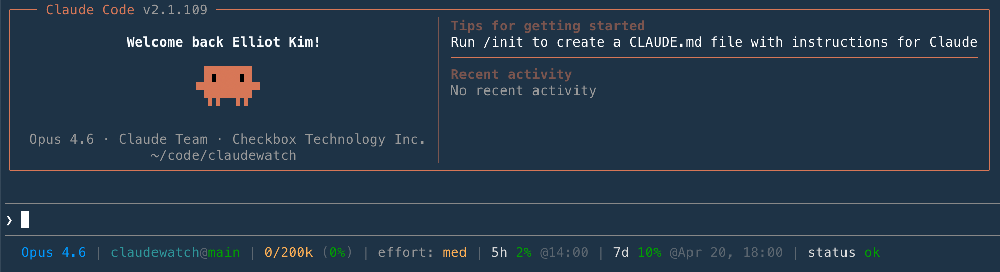

# ClaudeWatch

Native macOS menu-bar app for tracking Claude Code usage and Anthropic service status.


- Subscription usage from `~/.claude/claudewatch-usage.json`, written by the Claude Code statusline hook.
- Claude Code service health from `https://status.claude.com/api/v2/components.json`.
- Color-coded uptime history bar (30/60/90 days) sourced from incident data and the official status page.
- 26-week usage-history heatmap with session/streak/peak stats, backed by a local event log retained indefinitely.
- Customizable progress bar colors with dynamic, status-matching, and preset options.
- Real-time relative timestamps with absolute tooltips on hover.
- macOS 14 Sonoma+, Swift 5+/SwiftUI, sandboxed, zero external dependencies.

## Build

```sh
# One-time: point xcode-select at the full Xcode install if needed.
sudo xcode-select -s /Applications/Xcode.app
sudo xcodebuild -license accept
xcodebuild -runFirstLaunch

# Build the app:
xcodebuild -project ClaudeWatch.xcodeproj -scheme ClaudeWatch -configuration Debug build

# Run unit tests:
xcodebuild -project ClaudeWatch.xcodeproj -scheme ClaudeWatch test \
  -destination 'platform=macOS'
```

Or just open `ClaudeWatch.xcodeproj` in Xcode and Cmd-R.

## Run

After building, the `.app` is under `~/Library/Developer/Xcode/DerivedData/...`.
Launch it; a small percentage indicator appears in the menu bar. Click it (or
press ⌘⌥C) to show the popover.

## Usage data

ClaudeWatch reads usage from `~/.claude/claudewatch-usage.json`. This file is
written by a Claude Code statusline hook — ClaudeWatch itself never calls the
Anthropic API. **Usage data is only updated while Claude Code is actively being
used in the terminal**; ClaudeWatch has no way to fetch it independently.

### Installing the statusline hook

The included `statusline.sh` script is a Claude Code
[statusline](https://code.claude.com/docs/en/statusline)
hook that serves two purposes:

1. **Feeds ClaudeWatch** — each time the statusline renders, the script writes
   the latest usage data to `~/.claude/claudewatch-usage.json`.
2. **Enriches your terminal** — the statusline itself displays the current
   model, context-window token usage, reasoning effort, 5-hour and 7-day rate
   limit percentages, and live Claude Code service status.



The easiest way to install is with the included install script, which copies
the statusline into place, checks that `jq` is installed, and configures
`~/.claude/settings.json` for you:

```sh
./install-statusline.sh
```

Or install manually:

```sh
cp statusline.sh ~/.claude/statusline.sh
chmod +x ~/.claude/statusline.sh
```

Then add (or merge) the `statusLine` entry in your Claude Code settings
(`~/.claude/settings.json`):

```json
{
  "statusLine": {
    "type": "command",
    "command": "~/.claude/statusline.sh"
  }
}
```

The next time you start a Claude Code session in the terminal, the statusline
will appear and ClaudeWatch will begin receiving usage updates. If ClaudeWatch
shows stale data, it means no terminal session has run since the last update.

### Expected JSON schema

```json
{
  "five_hour": {
    "used_percentage": 38.0,
    "resets_at": 1713100000
  },
  "seven_day": {
    "used_percentage": 8.0,
    "resets_at": 1713500000
  },
  "updated_at": 1713099000
}
```

| Field | Required | Description |
|---|---|---|
| `five_hour.used_percentage` | yes | 0–100, current 5-hour session usage |
| `five_hour.resets_at` | no | Unix epoch when the session window resets |
| `seven_day.used_percentage` | yes | 0–100, weekly usage across all models |
| `seven_day.resets_at` | no | Unix epoch when the weekly window resets |
| `updated_at` | no | Unix epoch when the file was last written |

This is the shape the bundled `statusline.sh` writes today.

#### Optional: `weekly` array (newer, multi-bucket)

For clients that want to surface multiple weekly buckets (e.g. per-model
limits), a `"weekly"` array can be provided instead of `"seven_day"`. When
present, it takes precedence.

```json
"weekly": [
  { "label": "All models", "used_percentage": 8.0, "resets_at": 1713500000 },
  { "label": "Sonnet only", "used_percentage": 5.0, "resets_at": 1713600000 }
]
```

| Field | Required | Description |
|---|---|---|
| `weekly[].label` | yes | Display name (e.g. "All models", "Sonnet only") |
| `weekly[].used_percentage` | yes | 0–100, weekly usage for this bucket |
| `weekly[].resets_at` | no | Unix epoch when this weekly window resets |

## Layout

```
ClaudeWatch/
  App/            ClaudeWatchApp, AppDelegate, Info.plist, entitlements
  Models/         Severity, QuotaState, StatusState, Preferences, UptimeHistory,
                  UsageHistoryEvent, UsageHistoryStats
  Services/       Quota file reader, status HTTP, uptime client, usage history store,
                  notifications, Carbon hotkey
  Coordinator/    AppCoordinator (timers, wake observer, threshold detection, history recording)
  UI/             MenuBarLabel, PopoverRoot, Usage/Status/Uptime/UsageHistory/Settings sections,
                  HotkeyRecorder
ClaudeWatchTests/
  QuotaSyncClientTests, StatusClientTests, MockURLProtocol
```

## Configuration

All preferences live in `UserDefaults` (see `Models/Preferences.swift`) and are
editable from the popover's Settings section. Changes take effect immediately.

### Menu bar

| Setting | Default | Options |
|---|---|---|
| Show Claude Code status | Always | Always, Only when not operational, Off |
| Show 5h usage % | on | on/off |
| Usage graphic | None | None, Mini bar, Ring gauge, Logo fill, Segmented dots, Arc gauge |

### Colors

| Setting | Default | Options |
|---|---|---|
| Menu bar graphic | Dynamic | Dynamic, Monochrome, Match status color, Blue, Indigo, Purple, Teal, Mint, Pink |
| Usage bars | Dynamic | Dynamic, Match status color, Blue, Indigo, Purple, Teal, Mint, Pink |

Menu bar graphic controls the color of the usage graphic in the menu bar
(mini bar, ring, etc.). Usage bars controls the popover progress bars. Both
are configured independently. "Dynamic" uses the system primary color (black
in light mode, white in dark mode) and shifts through yellow/orange/red as
usage climbs. "Monochrome" also uses the primary color but stays flat.
Preset colors stay fixed. "Match status color" uses the current Claude Code
service health color. The menu bar percentage text always uses dynamic
coloring for readability.

### Notifications

Per-severity macOS notifications when Claude Code service status changes.

| Severity | Default |
|---|---|
| Recovered | on |
| Degraded / maintenance | on |
| Partial outage | on |
| Major outage | on |

| Setting | Default | Options |
|---|---|---|
| Session renewal | Off | Off, Always, When exhausted |

### Uptime history

| Setting | Default | Options |
|---|---|---|
| Uptime history | 30 days | Off, 30 days, 60 days, 90 days |

Shows a color-coded daily uptime bar for Claude Code below the status indicator.
Daily severity is computed from incident data; the 90-day uptime percentage is
scraped from the official status page.

### Usage history

| Setting | Default | Options |
|---|---|---|
| Usage history | Chart and stats | Off, Chart only, Chart and stats |

Records every 5-hour session (`start`, usage bumps, `end`) to a JSON event
log in the app's sandboxed Application Support directory. Events are retained
indefinitely. The popover shows a 26-week (182-day) calendar heatmap keyed
by total daily usage (sum of each session's peak %), tinted to match the
Usage-bars color preference. Hovering a cell surfaces that day's
session count and total usage.

When "Chart and stats" is selected, a 3×2 stat grid (Sessions, Active days,
Avg/Max peak, Current/Longest streak) and a `7d / 30d / All` segmented
picker appear above the heatmap. The duration picker only filters the
stats — the heatmap always shows the full 26-week window, and `All`
covers every retained event.

#### Seeding synthetic history (development)

To populate the heatmap without waiting for real sessions, run:

```sh
./seed-usage-history.sh             # 365 days of synthetic history
./seed-usage-history.sh --days 90   # custom window
./seed-usage-history.sh --clear     # wipe all events
```

The script writes directly to the app's sandboxed Application Support
directory. Reopen the popover (or relaunch the app) to pick up changes.

### Polling intervals

| Setting | Default | Range | Step |
|---|---|---|---|
| Usage polling | 30 s | 10–300 | 10 |
| Claude status polling | 300 s | 300–900 | 60 |

### Hotkey

| Setting | Default |
|---|---|
| Toggle popover | ⌘⌥C (rebindable) |

## Credits

The bundled `statusline.sh` is derived from
[ClaudeCodeStatusLine](https://github.com/daniel3303/ClaudeCodeStatusLine)
by [@daniel3303](https://github.com/daniel3303), used under its MIT
license. Modifications: write resolved usage data to
`~/.claude/claudewatch-usage.json` on every render so ClaudeWatch can
read it; removed the upstream self-update check. See the file header
and the [upstream LICENSE](https://github.com/daniel3303/ClaudeCodeStatusLine/blob/main/LICENSE)
for the original copyright and permission notice.

## License

[MIT](LICENSE)
