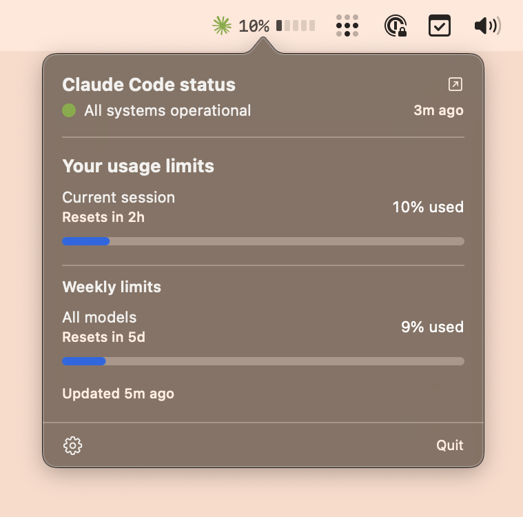

# ClaudeWatch

Native macOS menu-bar app for tracking Claude Code usage and Anthropic service status.



- Subscription usage from `~/.claude/claudewatch-usage.json`, written by the Claude Code statusline hook.
- Claude Code service health from `https://status.claude.com/api/v2/components.json`.
- macOS 14 Sonoma+, Swift 5+/SwiftUI, sandboxed, zero external dependencies.

## Build

```sh
# One-time: point xcode-select at the full Xcode install if needed.
sudo xcode-select -s /Applications/Xcode.app
sudo xcodebuild -license accept

# Build the app:
xcodebuild -project ClaudeWatch.xcodeproj -scheme ClaudeWatch -configuration Debug build

# Run unit tests:
xcodebuild -project ClaudeWatch.xcodeproj -scheme ClaudeWatch test \
  -destination 'platform=macOS'
```

Or just open `ClaudeWatch.xcodeproj` in Xcode and Cmd-R.

## Run

After building, the `.app` is under `~/Library/Developer/Xcode/DerivedData/...`.
Launch it; a small percentage indicator appears in the menu bar. Click it (or
press ⌘⌥C) to show the popover.

## Usage data

ClaudeWatch reads usage from `~/.claude/claudewatch-usage.json`. This file is
written by a Claude Code statusline hook — ClaudeWatch itself never calls the
Anthropic API.

### Expected JSON schema

```json
{
  "five_hour": {
    "used_percentage": 38.0,
    "resets_at": 1713100000
  },
  "weekly": [
    { "label": "All models", "used_percentage": 8.0, "resets_at": 1713500000 },
    { "label": "Sonnet only", "used_percentage": 5.0, "resets_at": 1713600000 }
  ],
  "updated_at": 1713099000
}
```

| Field | Required | Description |
|---|---|---|
| `five_hour.used_percentage` | yes | 0–100, current 5-hour session usage |
| `five_hour.resets_at` | no | Unix epoch when the session window resets |
| `weekly` | no | Array of per-model weekly limit windows |
| `weekly[].label` | yes | Display name (e.g. "All models", "Sonnet only") |
| `weekly[].used_percentage` | yes | 0–100, weekly usage for this bucket |
| `weekly[].resets_at` | no | Unix epoch when this weekly window resets |
| `updated_at` | no | Unix epoch when the file was last written |

For backward compatibility, a single `"seven_day"` object (same shape as
`five_hour`) is accepted in place of the `"weekly"` array and displayed as
"All models".

## Layout

```
ClaudeWatch/
  App/            ClaudeWatchApp, AppDelegate, Info.plist, entitlements
  Models/         Severity, QuotaState, StatusState, Preferences
  Services/       Quota file reader, status HTTP, notifications, Carbon hotkey
  Coordinator/    AppCoordinator (timers, wake observer, threshold detection)
  UI/             MenuBarLabel, PopoverRoot, Usage/Status/Settings sections, HotkeyRecorder
ClaudeWatchTests/
  QuotaSyncClientTests, StatusClientTests, MockURLProtocol
```

## Configuration

All preferences live in `UserDefaults` (see `Models/Preferences.swift`) and are
editable from the popover's Settings section. Changes take effect immediately.

### Menu bar

| Setting | Default | Options |
|---|---|---|
| Show Claude Code status | Always | Always, Only when not operational, Off |
| Show 5h usage % | on | on/off |
| Usage graphic | None | None, Mini bar, Ring gauge, Logo fill, Segmented dots, Arc gauge |

### Status notifications

Per-severity macOS notifications when Claude Code service status changes.

| Severity | Default |
|---|---|
| Recovered | on |
| Degraded / maintenance | on |
| Partial outage | on |
| Major outage | on |

### Session renewal

| Setting | Default | Options |
|---|---|---|
| Notify on 5h window reset | Off | Off, Always, When exhausted |

### Polling intervals

| Setting | Default | Range | Step |
|---|---|---|---|
| Usage polling | 30 s | 10–300 | 10 |
| Claude status polling | 300 s | 300–900 | 60 |

### Hotkey

| Setting | Default |
|---|---|
| Toggle popover | ⌘⌥C (rebindable) |

## License

[MIT](LICENSE)
